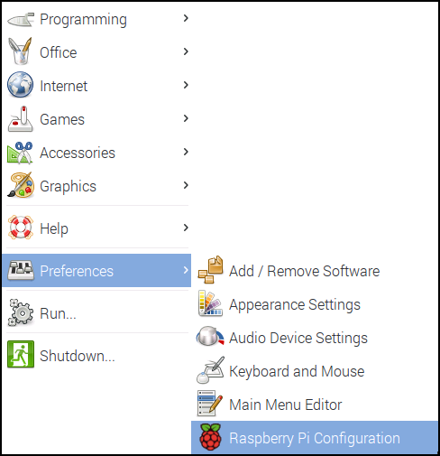
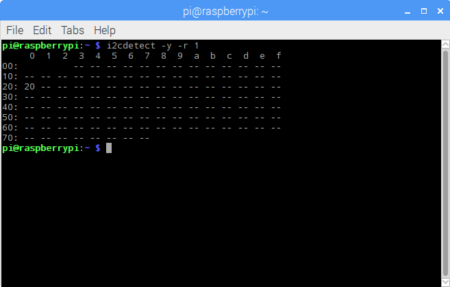

# Raspberry Pi Relay Controller for the Seeed Studio Raspberry Pi Relay Board (v1.0)

The [Seeed Studio Raspberry Pi Relay Board v1.0](https://www.seeedstudio.com/Raspberry-Pi-Relay-Board-v1.0-p-2409.html) is a 4-port relay controller board for the Raspberry Pi. The folks at Seeed Studio provide a rudimentary Python library for the board, but I wanted more. I copied their library from their Wiki page, formatted it for immediate use (it wouldn't run when copied from the Wiki page) and published it to my [Seed Studio Relay Board Github Repository](https://github.com/johnwargo/Seed-Studio-Relay-Board). I also created a cleaner Python library to use with the board plus a Python application you can use to exercise the board.

In my initial library, I implemented functions that allow a developer to turn any or all relays on and off, but little else. I wanted the ability to toggle a relay's status as well as read the current state of a relay (on or off). As I worked on that enhanced version of the library (finished and published to the Github repository), I needed an easy way to control the status of the board's relays as I tested the library's code.

I needed a simple app I could run from the browser (on the Pi, my development system or a smartphone), that allowed me to easily utilize each of the functions exposed by my library. That's what I created, and this is the Github repository for that project. The application is a Python application built using the [Flask micro framework](http://flask.pocoo.org/). When you run the application, it starts a simple web server that hosts the web page shown in the following figure as well as a series of APIs used by the web application.

   
When you tap/click any of the buttons in the app, the corresponding API on the server is triggered which calls the appropriate library functions to do things on the relay controller. Simple stuff! Check out the [Relay board library Repository](https://github.com/johnwargo/Seed-Studio-Relay-Board) for details on the library functions. 

## Hardware Components

To use this project, you'll need at a minimum the following hardware components:

+ [Raspberry Pi 3](https://www.raspberrypi.org/products/raspberry-pi-3-model-b/)
+ [Seeed Studio Raspberry Pi Relay Board v1.0](https://www.seeedstudio.com/Raspberry-Pi-Relay-Board-v1.0-p-2409.html)
+ 5V, 2.5A Micro USB power source (basically, a smartphone charger) - I use the [CanaKit 5V 2.5A Raspberry Pi 3 Power Supply/Adapter/Charger](https://www.amazon.com/gp/product/B00MARDJZ4)
 
## Assembly

## Configuring Your Raspberry Pi

### Validating Assembly

Update the JMW Article with this content: http://raspberrypi.stackexchange.com/questions/56413/error-problem-connecting-to-raspberry-pi-3-with-xrdp

this.

this. 

this.

## Software Installation

## Resources

Links to the wiki page and my article and sample code

## Update History

Nothing yet.

***
By [John M. Wargo](http://www.johnwargo.com) - If you find this code useful, and feel like thanking me for providing it, please consider making a purchase from [my Amazon Wish List](https://amzn.com/w/1WI6AAUKPT5P9). You can find information on many different topics on my [personal blog](http://www.johnwargo.com). Learn about all of my publications at [John Wargo Books](http://www.johnwargobooks.com). 